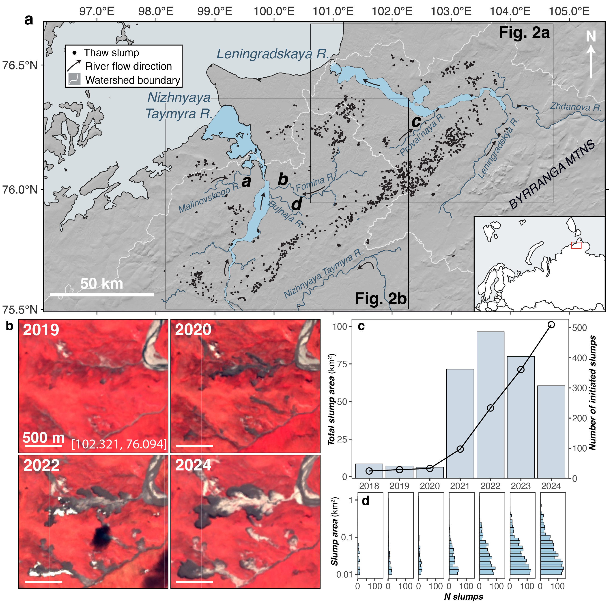
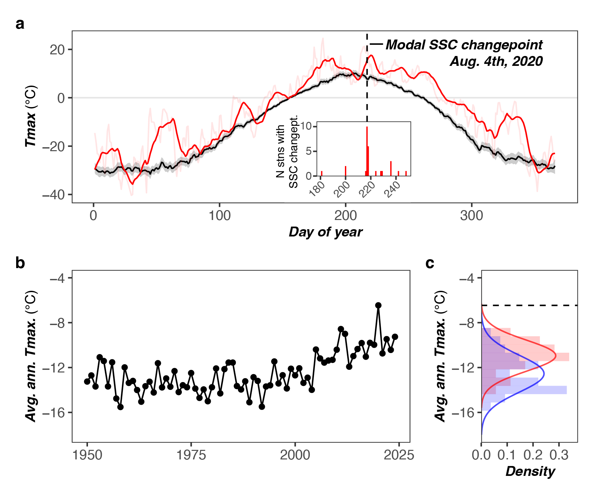
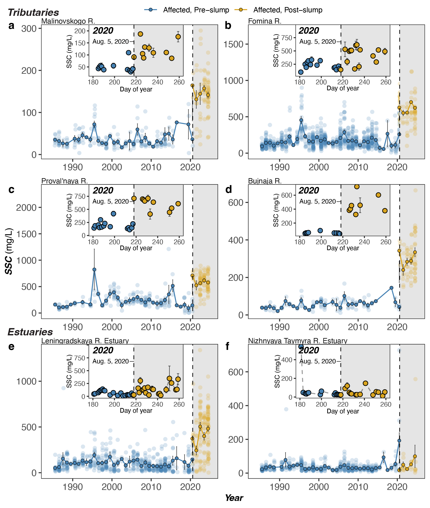
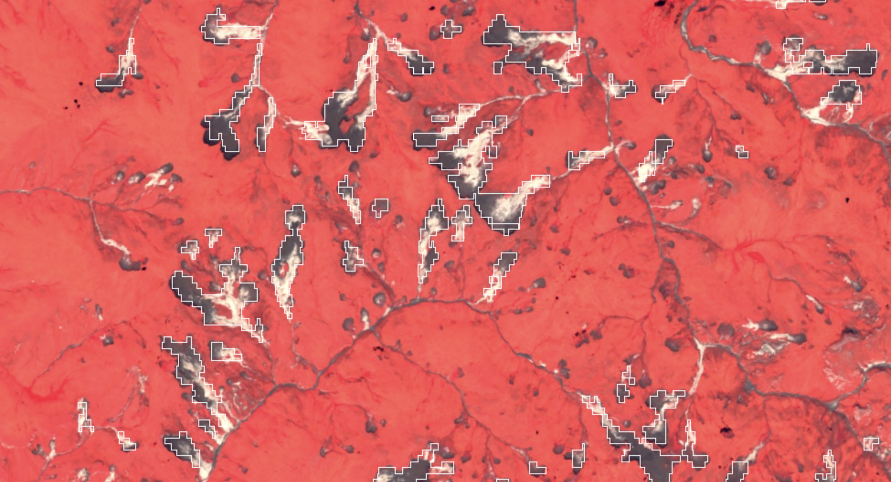
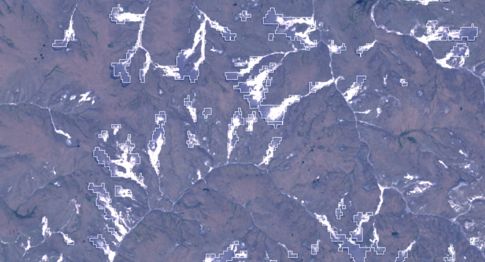

# Arctic Rivers

***Investigating the 2020 Taymyr Peninsula permafrost thaw slump event and its aftermath***

This work uses satellite remote sensing to identify permafrost thaw slump occurrence, track progressive growth of thaw slumps, and tie thaw slump erosion to increased river sediment transport.

The focus is a regional thaw slump event on the Taymyr Peninsula, Siberia, Russia. Hundreds of thaw slumps appear to have initiated in a single week, during the peak warmth of an extended heat wave in 2020. Since, these thaw slumps have continued to expand rapidly.

Rivers have responded accordingly, with increased suspended sediment concentration (SSC) measurable using satellite-based methods. Rivers initially were the "canary in the coal mine", registering a stepwise increase in SSC in early August, 2020, when slumps initiated. SSC for these rivers has continued to increase as slumps have grown since 2020.

This work is in review at Cryosphere, with a [pre-print available](https://doi.org/10.5194/egusphere-2025-5691) [@dethier2025]. The approach builds on existing methods for satellite-based estimation of SSC, extending them to Sentinel-2 data [@dethier2020; @dethier2022]. This allows the tracking of rapid slump failure on a near-daily basis in 2020.

We automated slump identification and delineation using conventional and machine learning methods for Landsat and Sentinel-2 data in [Google Earth Engine](https://earthengine.google.com/).

Slumps are outlined in white in the false color image (RGB: near-infrared, red, green) from 2024, above. Some small and incipient slumps are not yet identified. The same image is shown in true color below.

